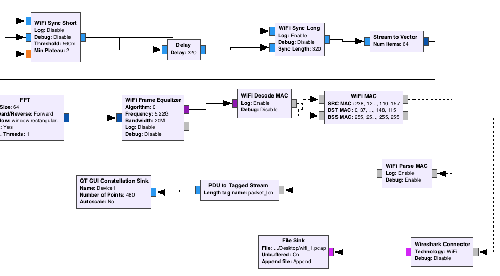
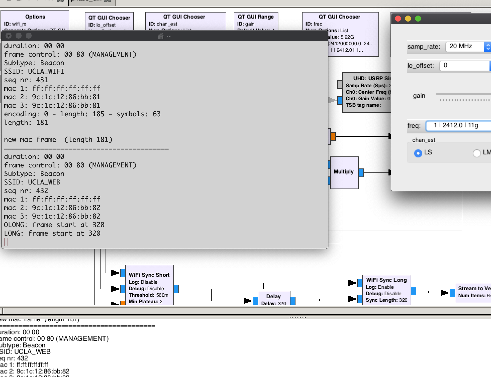
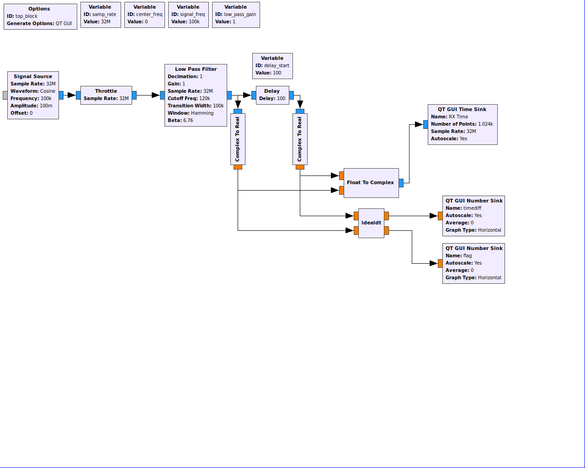
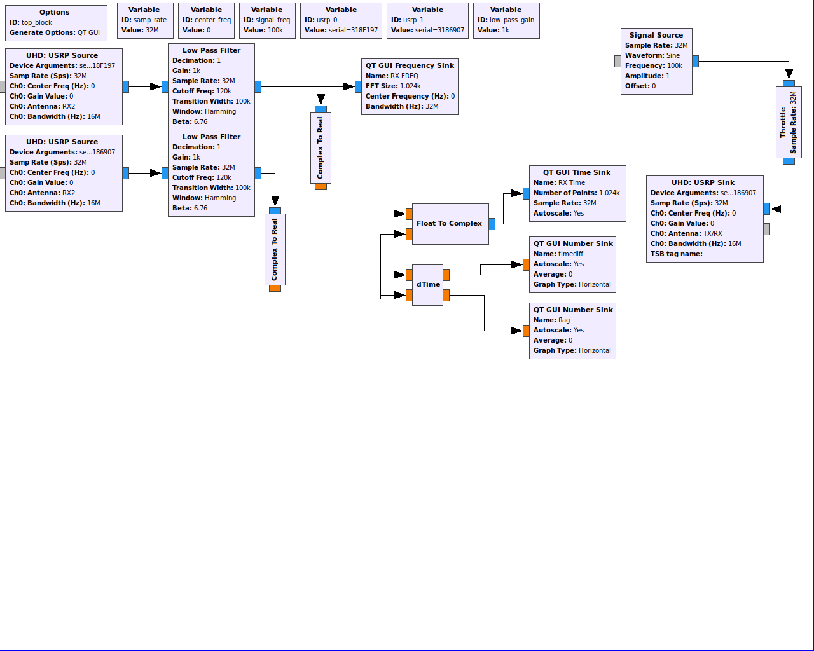

# Localizing and Visualizing Wireless Sensors
**Students:** Gabriel Biren, Chaohao Li, and Jinchi LI

## Introduction

### Overview
One suggested use of Augmented Reality (AR) is in “smart-factories”, where workers can point their devices toward sensors and view real-time information about them. Many systems have been suggested to mark the location of sensors and collect data from them, such as including LEDs that serve to visually identify sensors and which can blink at a high rate to convey information. Another notable suggestion is to simply have the sensor broadcast information over a wireless signal. The receiver could use localization techniques to locate the sensor, collect its broadcast data, and display this information through an AR application. In this project, we aim to implement the latter approach and perform the following.
- Use localization techniques to estimate the location of a wireless signal source.
- Collect and display information collected from the source.
- Develop an AR application to track the source as a user looks around the room.

### Theory
#### Direction of Arrival
The Direction of Arrival (DoA) of a wireless signal can be deduced from the time it arrives to a set of antennas. Most research focuses on antenna arrays, where 4 or more antennas are arranged in a specific configuration to accurately determine the direction. It is also possible to estimate the direction of the signal using only 2 antennas. Consider the following diagram.

In the left image, the signal arrives at both antennas at the same time. On the right, there is a large difference in the arrival time between the first and second antenna. Suppose the antennas are attached to the back of a tablet computer. If the tablet is directly facing the wireless source, it would look like the image on the left. Similarly, if the tablet is rotated 90 degrees from the source, the arrangement of the antennas would look like the image on the right. This suggests that we can determine that we are facing a wireless source when the signal arrives at the antennas at the same time, and that we are facing perpendicular to the source when the time difference between arrival at both antennas is maximized.

Consider the following equation. In this case, the variables include:
- ψ: Phase Difference
- D: Distance between antennas
- λ: Wavelength
- φ: Azimuth angle between receiver and sender
- θ: Elevation angle between receiver and sender

The distance between the antennas is fixed, and suppose we focus on a single wavelength. If we keep the elevation angle the same and vary the azimuth, we can observe the phase difference to determine if we are facing the wireless source or facing a perpendicular direction. Further, we can use a similar process to determine the elevation angle by fixing the azimuth and rotating the device around the Y-axis. This process allows us to estimate the azimuth and elevation coordinates of the wireless signal source.

Note that there is some ambiguity about the exact direction of the signal. For example, if the phase difference is 0, that might mean that the wireless source is directly ahead of or directly behind the receiver. Although there are methods to resolve this ambiguity, our project assumes that the wireless source is somewhere in front of the user during the localization process.

#### 3D Spaces and Images
We commonly think of locations in 3D space in terms of x, y, and z coordinates. However, it is also possible to represent locations in spherical coordinates using φ, θ, and r. The following relationship allows us to convert between the two representations.

Given a 3D coordinate and an image of the space containing the location, we can map the location in space to a spot in the image. Consider the following diagram.

The relationship between the real coordinates and the image plane is as follows.

In this case, f equals the focal length divided by the pixel size of the image sensor. If we replace x, y, and z in this equation with their equivalents in spherical coordinates, we arrive at the following relationship. Note that r is cancelled out of the final equation, so we only have to consider φ and θ.

### Prior Work
Our main reference is [When IoT met Augmented Reality](https://dl.acm.org/citation.cfm?id=3326079), which describes the implementation of the AR system described in the introduction. Notably, although several useful methods are discussed, the paper assumes that it is trivial to find the phase difference. Our experience suggests that it is difficult to design a GNU Radio that calculates the phase difference.

We also make use of the [Wime Project](https://www.wime-project.net/) which provides a GNU Radio system to capture WiFi packets. We modified the WiFi receiving flowchart to collect data from a specific device.

## GNU Radio

### Setup
#### Equipment
Our project uses 2 B205mini USRPs to act as the two receiving antennas. We also need a computer with GNU Radio installed to process the received signals. GNU Radio works best on Linux, so we decided to run it in a virtual machine on our computer.

We also collect data from the gyroscope sensor, so we use the Windows Sensor Library. Because the sensor library only runs on Windows and GNU Radio runs on a Linux virtual machine, we developed a local server that records our sensor and phase difference readings.

Finally, this data is provided to the AR application which superimposes information about the sensor onto a live video stream of the environment. The entire project is run on a Surface Pro, which allows us to run Windows applications and make use of the device’s camera and IMU sensors.

#### USRP Setup Notes
Be sure to follow these steps to start using the USRP devices.
- Find the USRP devices on the computer using terminal. Record the serial number for each device.
-  If the computer failed to find the USRPs, we need to make sure there is only one uhd-find-device file installed in our computer.

### WiFi Detection
Before we started the phase difference calculation, we managed to successfully detect a WiFi signal using GNU Radio. After setting up the Wime project, we were able to detect the WiFi signals around us using our USRPs. The project collected packets and outputted them in a pcap file, which could be examined with WireShark.

To make the prior work more adaptable to our project, we modified the flowchart by creating a block called WiFi MAC which allows us to filter packets by mac address, source address, and destination address. Developing this block served as an introduction to writing GNU Radio blocks, and allowed us to focus our attention on a specific WiFi signal.

While the collected information contained valuable things like the source and destination addresses, protocol information, and the data each packet contained. However, it did not say anything about the phase difference. Moreover, the time intervals between every two frames include the processing time of decoding the packet, which degrades the quality of time accuracy. As a result, we were not able to directly use the decoded time information to calculate the time difference. The screenshot below shows the results captured by a sample run.

The flowchart and the result of this WiFi detection part can be found in our GitHub. You will find it clearer by looking at the logic through the flowchart.

### Time Difference
The main value that we need in order to locate a wireless device is the phase difference of the received signals from the device. Finding the phase difference from multiple antennas requires the time and clock synchronization across though the whole system. We were not able to find any examples of calculating the phase difference in GNU radio, so we decided to make a new block with gr_modtool. Instead of calculating the phase difference directly, we found that it was easier to design a block that calculates the time difference. This is simple to translate to the phase difference using simple math. 

Our block has two input ports to take in readings of the same wave separately from two antennas. The block would detect the peaks within the received frame and calculate the time difference between the two peaks. The time difference would only be exported when both peaks of two waves are within the same received frame. The block would constantly update the time difference when it detects a moment when certain value readings of the waves fit the definition of peaks better. After a few seconds, the time difference measurement would be stable and reliable. The two outputs are the time difference with the units of microsecond, and a flag to indicate which antenna receives the signal first.

The following images show the GNURadio flowchart for “idealdt” block and the flowchart for “dTime” block, respectively.

The code is in the GitHub repo under gr-diffApp directory. The functionality description of the module is also in the README.diffApp

## AR Platform
We implemented the AR application in Python using OpenCV for the image processing. Under proper operation, the program would first observe the phase difference to determine the initial location of the wireless source. Because we were not able to complete this portion of the project, we just initialize φ and θ to π/2 which indicate that the source is directly ahead of the camera.

Once the initial localization has taken place, the spherical coordinates are updated from the gyroscope readings. The gyroscope provides data in units of degrees per second. We sample this data every 50 ms and multiply by 50 ms to integrate it, thereby obtaining the number of degrees that the camera moved in that time interval. The angle change along the x, y, and z axes are represented by α, β, and ɣ, respectively. The updated coordinates x’, y’, and z’ can be found by using the following operation.

After the updated coordinates have been calculated, we use OpenCV to draw a circle centered at the new location in the image.

## Results
### GNU Radio
Using the Wime project as a springboard, we were able to capture information from a specified WiFi signal with our USRP devices. Although the data is currently logged to a pcap file, we could have written an external script to periodically decode the binary data and upload it to our local data server.

Developing the phase difference logic proved to be our main challenge. We were not able to find any clear examples of determining the phase difference of the same signal captured on two antennas. After trying several methods, we opted to develop a module that could determine which antenna first received an ideal cosine wave. When we modeled the cosine wave in GNU Radio and fed it directly into our module, we got an accurate time difference between these two signals and were able to determine which antenna was closer to the signal source. Next, we transmitted this cosine wave through one of the USRP’s TX antennas and observed how the two RX antennas received the signal. We found that this was significantly less accurate because the signals were distorted, making it difficult to find the peaks.

The following images show the result of “idealdt” block flowchart as wave_2 is 200 samples delayed to wave_1, and of “dTime” block flowchart as receiving signals from two antennas, respectively.

We also found that it is difficult to synchronize the clocks of our two USRP devices. One [forum](http://ettus.80997.x6.nabble.com/USRP-users-Synchronizing-multiple-B205-mini-radios-td9894.html) suggested that “is a DPLL that simply cannot maintain low mutual phase noise because of the way the servo works” and because the PLL is “ digital and implemented inside the FPGA”. 

There may be workarounds to this, but we were not able to implement them in our project. For instance, additional hardware like an external clock source, or improved hardware like a single USRP device with 2 RX antennas, could have simplified our design. In addition, it was suggested that we could use the USRP’s GPIO port to output a pulse during each peak detection. We were not able to implement this because of time constraints in reasering the GPIO interface, and because we were not able to find the right wire.

### AR Platform
The AR platform worked fairly well. The application was able to track the object using the gyroscope readings, even when it went off camera ([demo](https://drive.google.com/file/d/184U5JmhdcuX3xee_eoqIyh_8Jc77DmVc/view?usp=sharing)). While it worked well enough for our demo, there were some things that could be improved.

*  The gyroscope readings were fairly noisy ([demo](https://drive.google.com/file/d/1XyXOzY-ikFXkSV3zwAyzMqZ3bl6ZP3MB/view?usp=sharing)). As a result, even when the camera was stationary, the object’s location would drift on-screen. This could probably be fixed by filtering noisy values values, but we did not decide on a specific method to perform this filtering.
* We determined the f value (focal length divided by pixel size) empirically by trial and error because our tablet did not provide the required information. We feel that if we could obtain the right values, our application would track the location of the object more accurately.
* There is a “bounce” phenomenon where if the rotate the camera down toward the ground, the circle bounces back onto the screen instead of disappearing off-camera. This seems to be an arithmetic error, but we did not have time to debug and find the exact cause of the issue.

## Future Work
### Hardware Improvements
As mentioned in the results section, using a single USRP device with 2 RX antennas would allow us to better synchronize the time that the signal arrives at both antennas. Another workaround is using an external clock reference. The B205i mini accepts  PPS or 10MHz external clock reference. Something like OctoClock-G CDA-2990 (OCTOCLOCK-G CDA-2990 8-Channel Clock Distribution Module with Integrated GPSDO) can do the job, but might be too expensive for our purposes.

Another option would be to experiment with full antenna arrays. For example, the TwinRX 10-6000 MHz 2 Rx, has a 4 receive antenna array on board. Since the array is integrated into a single board, the phase offset of the antenna array can be determined easily. Additionally, GNU Radio provides a module that calculates the direction of arriving signal. By using this device, the development time and effort can be reduced and the quality of the result can be improved. 

### AR Methods
While the current AR application does a good job at tracking a spot using gyroscope measurements, its accuracy could be improved with several methods. One simple improvement would be to use OpenCV’s object tracking capabilities. After the initial localization of the sensor, we could designate a patch in the image and have OpenCV keep track of the spot. This would work if the sensor could be clearly recognized, perhaps having a bright color, but would not work if the sensor was hidden behind a wall. Another approach would be to use an AR framework like ARCore to perform accurate tracking once the initial location has been found. This would significantly improve the quality of the tracking, but would also increase the overhead.

## Links
* [Final Video]()
* [Midterm Slides](https://docs.google.com/presentation/d/1LzhMSHXwGUKzLoH9U3LpD5Lpro57VzhPEua1SPNTdw0/edit?usp=sharing)
* [Final Slides](https://docs.google.com/presentation/d/17b3BoW3Al1qonz2HLCKMBJaqk9Q_wKXkKNC4qkhbflI/edit?usp=sharing)
* [GitHub Repo](https://github.com/uclalch/Localizing-and-visualizing-wireless-sensor/)
* [Stationary Camera Demo](https://drive.google.com/file/d/1XyXOzY-ikFXkSV3zwAyzMqZ3bl6ZP3MB/view?usp=sharing)
* [Moving Camera Demo](https://drive.google.com/file/d/184U5JmhdcuX3xee_eoqIyh_8Jc77DmVc/view?usp=sharing)